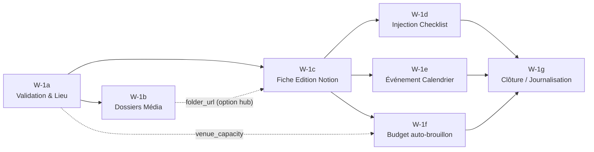

# W-1 · AFTRSN-Event-Creator — Découpage en sous-workflows

**Statut :** ❌ **REMPLACÉ le 04.07.2026 par `AFTRSN_Architecture_Processus_20260704.md`.** Ce document découpait le workflow (W-1a→W-1g, découpage technique) au lieu de découper le métier — source de confusion. Le nouveau document structure l'ensemble par processus métier réels (P1 Création d'édition → P5 Post-event). Conservé pour référence uniquement — ne pas implémenter. Le périmètre métier et les contrats de données documentés ici ont été repris dans le nouveau document.
**Remplace :** Draft v1 du 03.07.2026 (rédigé avant la clarification métier, partiellement obsolète).
**Base technique :** `AFTRSN-Event-Creator` (n8n id `kjuj3r0QVP6ZicIr`), version monolithique corrigée le 04.07.2026 : node `Create an event` réparé (description → fiche Notion, option B), `Merge2` supprimé, 4 nodes Notion repointés vers les DB du **🎭 The Backstage** (teamspace AFTER SUN PEOPLE - HQ).
**Décision Karter (03.07.2026) :** diviser le workflow en sous-workflows reflétant les étapes de la logique métier, pas un découpage technique arbitraire.

---

## 1 · Périmètre métier de W-1 (nouveau en v2)

Le process métier de référence : **une date reçue du lieu = un événement = déclenchement automatique complet de l'administratif, sans validation humaine, identique à chaque fois.**

**Dans W-1 (administratif automatique) :**
- Upsert du lieu, fiche Edition (hub central), checklist, arborescence Drive, événement calendrier, budget auto-brouillon, journalisation mémoire.

**Hors W-1 (workflows séparés, en aval) :**
- **Pack promo** (flyer + déclinaisons) : travail humain sur Canva, validé par la **core team** avant diffusion manuelle — jamais automatisé dans W-1.
- **Publicités** : auto-créées ailleurs (paramètres quasi identiques, Zürich = référence), jamais publiées sans revue humaine ; monitoring/optimisation par agent via Hermès, exécution après validation Karter.
- **Site web (Wix)** : page événement auto-construite, publication manuelle.
- **Newsletter** : déclenchée à la publication du site, uniquement si un segment existe pour la ville ; segmentation manuelle dans Wix, automatisation reportée à un futur workflow dédié.

Le **dossier photos & vidéos** créé par W-1 est une coquille vide remplie **après** l'événement (usage post-promo) — à ne pas confondre avec le pack promo.

## 2 · Pourquoi découper (rappel v1, toujours valable)

Les bugs du 03.07 (référence croisée `$('Create folder')` cassée, connexion résiduelle créant des doublons, diagnostic pénible sur 27 nodes) sont structurellement évités par des sous-workflows : toute dépendance devient un paramètre explicite d'`Execute Workflow`, plus aucune référence implicite entre blocs. Note v2 : la dépendance croisée fautive a été supprimée à la racine le 04.07 (le calendrier pointe vers la fiche Notion, hub central, plus vers le dossier Drive) — le découpage reste souhaité pour la lisibilité, la testabilité et le support.

## 3 · Architecture cible

Un **orchestrateur** (W-1 allégé, toujours déclenché par AFTRSN-Maestro) enchaîne 7 appels `Execute Workflow`, en passant à chacun uniquement les champs nécessaires.

```
W-1 (Orchestrateur)
 ├─ W-1a — Validation & Lieu (upsert Venue 🎭, lit la capacité du lieu)
 ├─ W-1b — Dossiers Média Drive          ─┐ parallèles entre eux
 ├─ W-1c — Fiche Edition (Notion 🎭)     ─┘ (après W-1a)
 ├─ W-1d — Injection Checklist           ─┐
 ├─ W-1e — Événement Calendrier          ─┤ parallélisables (après W-1c)
 ├─ W-1f — Budget auto-brouillon         ─┘
 └─ W-1g — Clôture / Journalisation (dernier, agrège tout)
```

## 4 · Carte des dépendances (changements v2)



**Changements vs v1 :**
- **W-1e ne dépend plus de W-1b** : la description du Calendar event pointe vers `page_url` (fiche Notion = hub central), plus vers `folder_id`. La dépendance qui avait causé le bug du 03.07 disparaît du contrat.
- **W-1b devient une branche feuille** : plus personne n'en dépend strictement. Option recommandée : passer `folder_url` à W-1c pour l'inscrire dans la fiche Notion (le hub doit référencer le Drive) — dépendance explicite via l'orchestrateur, propre.
- **W-1f reçoit `venue_capacity`** (nouveau champ `Capacity` de la DB Venues 🎭, lu par W-1a) pour le budget auto-brouillon.

## 5 · Détail par sous-workflow

### W-1a — Validation & Lieu
**Nodes regroupés :** `If` → `Edit Fields` / `Erreur - reponse` → `Notion - Chercher Venue` → `Verifier Venue existante` → `If1` → (`Edit Fields1` | `Create a database page` → `Venue - Nouvelle`) → `Merge1`
**Entrée :** `edition_name`, `city`, `event_date`, `venue_name`, `capacity_target`, `requested_by`
**Sortie :** `venue_id`, `venue_capacity` *(nouveau v2 — lu sur la page Venue 🎭, vide si lieu nouveau)*, champs d'entrée relayés, `status`
**Métier :** validation de la commande, upsert du lieu (chercher avant créer, filtre "Contains" — jamais "Equals"). DB : **Venues 🎭** `b9001abd-8332-4bbb-9673-6deb5159b4f3`.

### W-1b — Dossiers Média (Drive)
**Nodes regroupés :** `Create folder` → `Create folder1` → 4 × sous-dossiers → `Merge - Dossiers média`
**Entrée :** `edition_name`, `event_date`
**Sortie :** `folder_id`, `folder_url`
**Métier :** arborescence **Année/Mois/Édition** (seule la date groupe les dossiers, jamais la ville), sous-dossiers canon `YYYYMMDD_AFTSN_Photos/Videos` × `Raw`/`Edited`. Coquille vide remplie post-event.

### W-1c — Fiche Edition (Notion)
**Nodes regroupés :** `Create a database page1`
**Entrée :** `venue_id`, `edition_name`, `city`, `event_date`, `capacity_target`, `folder_url` *(option hub, recommandée)*
**Sortie :** `page_id`, `page_url`
**Métier :** crée la page dans **Editions 🎭** `dad7f826-891f-4c29-80e4-183c59bac8b0`, `Status=Planning`, `Venue` en relation. La fiche est le **hub central** : c'est elle que référencent le calendrier et, à terme, tous les livrables.

### W-1d — Injection Checklist
**Nodes regroupés :** `Notion - Injecter checklist` (HTTP Request, méthode **PATCH**)
**Entrée :** `page_id` — **Sortie :** `status`
**Métier :** checklist standard injectée dans le corps de la fiche Edition.

### W-1e — Événement Calendrier
**Nodes regroupés :** `Create an event`
**Entrée :** `page_url`, `edition_name`, `event_date` *(plus de `folder_id` — v2)*
**Sortie :** `calendar_event_id`, `calendar_url`
**Métier :** événement Google Calendar (`hello@aftersunpeople.com`), description = lien vers la fiche Notion.

### W-1f — Budget auto-brouillon *(évolution v2)*
**Nodes regroupés :** `Preparer lignes Budget` → `Notion - Amorcer Budget & Finance`
**Entrée :** `page_id`, `venue_capacity`, `city`
**Sortie :** `status`, lignes créées
**Métier :** crée les 5 lignes (Venue/Artists/Production/Marketing/Media) dans **Budget & Finance 🎭** `05d7f280-5ffa-48c4-a1b5-a32dc4c38c99`. **v2 :** pré-remplir `Planned` à partir des **moyennes historiques** des éditions passées + de la **capacité du lieu** — brouillon automatique, finalisation humaine (jamais d'engagement de dépense automatique). Implémentation en deux temps possible : v2.0 lignes vides (comme aujourd'hui), v2.1 moyennes historiques une fois quelques éditions dans la DB 🎭.

### W-1g — Clôture / Journalisation
**Nodes regroupés :** `Merge` → `Memoire - Save Episode` → `Agreger resume`
**Entrée :** sorties agrégées (`page_url`, `folder_url`, `calendar_url`, statuts)
**Sortie :** `{status, notion_url, drive_url, calendar_url}` renvoyé à Maestro
**Remarque :** `Memoire - Save Episode` appelle déjà le sous-workflow `LUMINA-MEMORY-WRITE/WEBHOOK` — le pattern d'orchestration existe déjà partiellement.

## 6 · Contrat d'interface

| Sous-workflow | Reçoit | Renvoie |
|---|---|---|
| W-1a | `edition_name`, `city`, `event_date`, `venue_name`, `capacity_target`, `requested_by` | `venue_id`, `venue_capacity`, `status` |
| W-1b | `edition_name`, `event_date` | `folder_id`, `folder_url` |
| W-1c | `venue_id`, `edition_name`, `city`, `event_date`, `capacity_target`, `folder_url`* | `page_id`, `page_url` |
| W-1d | `page_id` | `status` |
| W-1e | `page_url`, `edition_name`, `event_date` | `calendar_event_id`, `calendar_url` |
| W-1f | `page_id`, `venue_capacity`, `city` | `status`, lignes créées |
| W-1g | `page_url`, `folder_url`, `calendar_url`, statuts | résumé final |

\* option hub recommandée. Règle inchangée : chaque sous-workflow reçoit uniquement ses champs, jamais l'item complet — testable indépendamment.

## 7 · Gestion d'erreur (inchangé v1, confirmé par le process métier)

- Chaque sous-workflow renvoie `{status:"error", step, message}`, pas de plantage sans contexte.
- Échec W-1a → tout s'arrête (rien n'a de sens sans `venue_id`). Échec W-1d/W-1e/W-1f → indépendants entre eux, l'orchestrateur continue et agrège les statuts.
- Pas d'écriture partielle silencieuse, aucune action destructive, aucun sous-workflow déclenché isolément en usage normal (risque de doublons).
- Conforme au process : l'administratif se déclenche **sans validation humaine** ; tout ce qui engage une dépense, une publication ou un envoi reste hors W-1 et gaté par validation (invariants Lumina OS).

## 8 · Options ouvertes

- **Parallélisation W-1d/e/f** : toujours possible, toujours non retenue (lisibilité du log d'exécution d'abord).
- **`folder_url` dans la fiche Notion (option hub)** : recommandée en v2, à trancher par Karter — impose W-1b avant W-1c dans l'orchestrateur (sinon les deux restent parallèles).
- **Budget historique (W-1f v2.1)** : nécessite des données d'éditions passées dans la DB 🎭 — activer plus tard.

## 9 · Plan de migration

1. Créer les 7 sous-workflows vides (trigger `Execute Workflow`, contrats §6) dans `AFTRSN-04-AUTOMATION`, tags conformes Bible §C.
2. Déplacer les nodes existants par blocs (copier-coller, pas de reconstruction).
3. Remplacer toute référence `$('NodeName')` inter-blocs par les paramètres d'entrée (`$json.page_url`, etc.).
4. Vider W-1 de son détail métier → 7 nœuds `Execute Workflow` selon la carte §4.
5. Tester chaque sous-workflow isolément (payload jetable `ZZTEST-…`), puis le pipeline complet via l'orchestrateur.
6. Vérifier l'absence de régression : pas de doublon Venue/Edition, checklist injectée, event calendrier pointant vers la fiche Notion, lignes budget créées — le tout dans les DB 🎭.
7. Publier, archiver la version monolithique pour référence.

**Prérequis avant migration :** test end-to-end du monolithe repointé réussi (en cours au 04.07 — bloqué sur le partage du 🎭 The Backstage avec l'intégration `AFTRN-n8n`).

## 10 · Prochaines étapes

Validation Karter de ce draft v2 (notamment : option hub `folder_url`, périmètre W-1f v2.0 vs v2.1) → implémentation selon §9.
